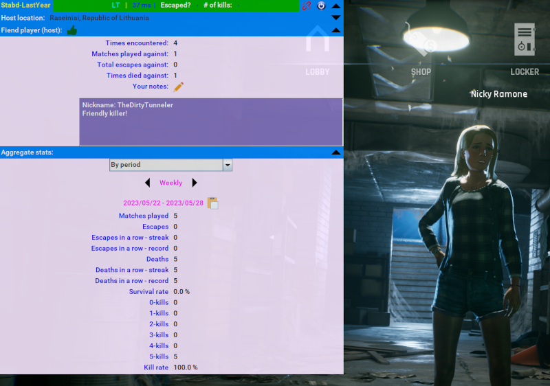

# What is Stabd?

Stabd (short for "Stats by Daylight") is a tool to gather basic stats of your matches in "Dead By Daylight" (DBD).
It is basically a hacked stripped version of the (
discontinued) [LOOP (Lobby Simulator Companion)](https://github.com/nickyramone/LobbySimulatorCompanion) project.

# What features does it have?

- Aggregate statistics of escape and kill counts.
- Lobby region identification.
- Stopwatch timer.

# How does it work?

After starting this application, you will have a small panel always on top of your screen.
Every time you finish a match, you can use hotkeys to provide results about that match. Stabd will then gather that
information and aggregate it in different ways.

### Summary of hotkeys:

| Hotkey                    | Description|
|---------------------------|:-----------------------------------------------|
| **\<Ctrl\> + E**          | Indicate that you survived (escaped) the trial.|
| **\<Ctrl\> + D**          | Indicate that you died in the trial.|
| **\<Ctrl\> + 0**          | Indicate that killer got 0 kills.|
| **\<Ctrl\> + 1**          | Indicate that killer got 1 kills.|
| **\<Ctrl\> + 2**          | Indicate that killer got 2 kills.|
| **\<Ctrl\> + 3**          | Indicate that killer got 3 kills.|
| **\<Ctrl\> + 4**          | Indicate that killer got 4 kills.|
| **\<Ctrl\> + \<Enter\>**  | Submit info (survival + kills) for this match. Once you submit, it cannot be edited.|
| **\<F4\>**                | Start/stop timer. You can use it to measure whatever you want.|

**Important**: Hotkeys will only be accepted if you have focus on the DBD window or Stabd window. Trying to use the
hotkeys while the focus is on any other application will have no effect.

# What does it look like?

Here are some sample screenshots:

# How to install?

1. Make sure you satisfy the system requirements:
    * Microsoft Windows (preferrably, Windows 10, which is what we test in)
    * Java Runtime of at least version 8 (https://java.com/en/download/)
    * Npcap (https://nmap.org/npcap/).
        * Tick "Install Npcap in WinPcap API-compatible Mode" during installation
          (For advanced users: Add %SystemRoot%\System32\Npcap\ to PATH instead.)
1. Download stabd.exe from the [releases page](https://github.com/nickyramone/stabd/releases).
1. Create a folder where you would like to install this app (Example, under C:\Program Files\Stabd)
   and place the exe there.
    * Tip: Don't throw it under the desktop. Instead, create a folder where to contain this application, and then create
      a desktop launcher if you want.

# How to run?

1. Double click on stabd.exe on your installation folder.\
   **NOTE:** You may need to right-click on the file, select Properties, and choose "Unblock" if it appears below "
   Attributes".
1. If the application started successfully, you should see at least these two files in the installation directory:\
   stabd.ini, stabd.dat

# Is my data stored in or published to any servers?

No. We don't publish any data to any servers, which means that if you lose your installation folder
your data will be lost.
To prevent this, we recommend doing backups of the 'stabd.dat' file.

## Hey! My antivirus is giving me a warning about the exe file!

Some antivirus throw a false positive because the executable file is not signed. This requires setting up a certificate
to validate with Microsoft Windows, and I have no intention to do that.

## Can I get banned by EAC (Easy Anti Cheat) for using STABD?

No.
Stabd does not modify or interact with the game files, does not hook intself to any executables and you cannot gain any
in-game advantage by using it.

## How can I contact the author?

You can send an email to 
